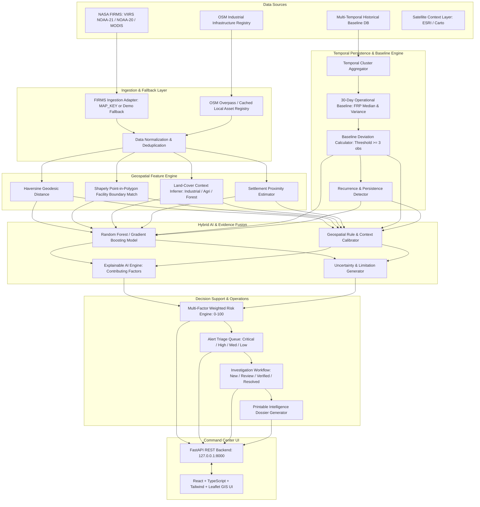

# System Architecture & Data Pipeline

**Platform:** THERMOSCOPE AI  
**Problem Statement:** NTRO SIH PS ID 26162  
**Tagline:** *AI-Powered Industrial Thermal Intelligence & Early Warning System*

---

## 1. High-Level Architecture

ThermoScope AI bridges raw satellite radiometric observations with industrial infrastructure context, eliminating the fundamental limitation of NASA FIRMS: answering not just **WHERE** heat was observed, but **WHAT** it represents, **WHY**, and **HOW CONFIDENT** the assessment is.

---

## 2. Core Functional Pillars

1. **Dual Operational Modes:**
   - **LIVE MODE:** Queries live NASA FIRMS API when credentials are provided.
   - **DEMO MODE:** Uses pre-seeded, high-fidelity Indian industrial clusters (Jamnagar, Hazira, Angul, Korba, Dhanbad, Trombay, Digboi, Punjab). Works 100% offline without external internet.

2. **Geospatial Proximity & Point-in-Polygon:**
   - Shapely evaluates whether an anomaly coordinate falls inside mapped facility polygon boundaries.
   - Distance to nearest mapped asset is dynamically measured in meters.

3. **Statistical Baseline Cutoff Rule:**
   - To prevent fabricated baselines, a minimum of 3 historical observations is strictly required before calculating median FRP and deviation percentage. Otherwise, the system reports `"Insufficient historical data"`.

4. **Multi-Factor Risk Scoring:**
   - Combines Intensity (FRP), Proximity, Baseline Abnormality, Persistence, Asset Criticality, and AI Confidence into a transparent 0–100 score.
